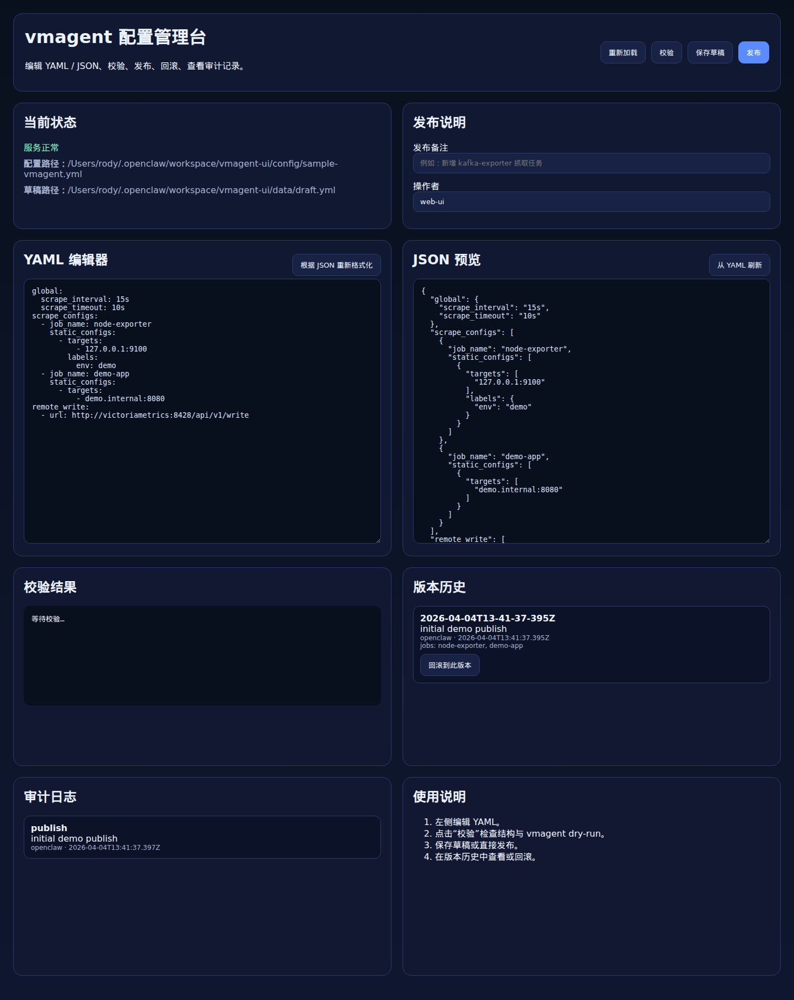

# vmagent-ui

一个面向 vmagent 的轻量 Web 配置管理界面 MVP，支持：

- 读取当前 YAML 配置
- YAML / JSON 双视图
- 服务端校验
- revision 历史
- 发布与回滚
- 审计日志
- 可选 reload / restart 接口编排
- 面向 vmagent 官方分布式能力的参数化管理思路

## 界面截图



## 功能说明

### 已实现的 MVP 功能

- **配置读取**：从目标 YAML 读取当前配置并生成草稿
- **双视图编辑**：YAML 编辑 + JSON 预览/反向渲染
- **校验链路**：YAML 解析、基础业务规则校验、可选 `vmagent -dryRun`
- **发布流程**：生成 revision、原子写盘、调用 reload/SIGHUP/restart 占位编排
- **版本管理**：保存 revision，支持回滚
- **审计记录**：保存 draft / publish / rollback 操作日志

### 适合继续扩展的功能

- 登录与 RBAC
- 结构化表单编辑器
- 更精细的 diff 展示
- 多文件配置联动
- Docker / Kubernetes / systemd 适配器
- 集群实例批量发布与灰度控制

## 与 vmagent 官方能力的关系

这个项目**不重新实现 vmagent 的分布式能力**，而是把官方已有能力做成更可视化的配置与发布体验。

根据 VictoriaMetrics 官方文档，vmagent 原生支持：

- **抓取集群分片**：`-promscrape.cluster.membersCount`、`-promscrape.cluster.memberNum`
- **抓取副本**：`-promscrape.cluster.replicationFactor`
- **remote write 分片**：`-remoteWrite.shardByURL`
- **多目标 remote write / 复制**：多个 `-remoteWrite.url`
- **本地缓冲目录**：`-remoteWrite.tmpDataPath`
- **配置重载**：`POST /-/reload`、`SIGHUP`（取决于部署与配置）

因此，这个 UI 的职责是：

- 管理 vmagent 配置文件
- 管理分布式相关参数
- 管理 revision / 审计 / 回滚
- 协助调用 reload / restart
- 为 Docker / K8s / systemd 场景提供统一入口

参考官方文档：

- <https://docs.victoriametrics.com/victoriametrics/vmagent/>
- <https://docs.victoriametrics.com/victoriametrics/data-ingestion/vmagent/>
- <https://docs.victoriametrics.com/operator/resources/vmagent/>
- <https://docs.victoriametrics.com/helm/victoria-metrics-agent/>

## 快速开始

```bash
cd vmagent-ui
npm install
npm start
```

默认访问：`http://127.0.0.1:3099`

## 环境变量

- `PORT`：服务端口，默认 `3099`
- `VMAGENT_CONFIG_PATH`：vmagent 主配置文件路径
- `VMAGENT_BIN`：vmagent 二进制路径，默认 `vmagent`
- `VMAGENT_RELOAD_URL`：例如 `http://127.0.0.1:8429/-/reload`
- `VMAGENT_PID`：如果要用 `SIGHUP`
- `VMAGENT_RESTART_CMD`：例如 `systemctl restart vmagent`
- `DEFAULT_AUTHOR`：默认操作者名

## 工作流

1. 读取当前草稿配置
2. 编辑 YAML 或 JSON
3. 点击“校验”执行：
   - YAML 解析
   - 基础业务规则
   - vmagent `-dryRun`（如果本机有 vmagent）
4. 点击“发布”后：
   - 生成 revision
   - 原子写入目标文件
   - 执行 reload / SIGHUP / restart（按配置优先级）
   - 写入审计日志

## 目录

- `server.mjs`：Fastify API + 静态页面服务
- `public/`：前端页面
- `config/sample-vmagent.yml`：示例配置
- `data/revisions/`：版本快照
- `data/audit/`：审计日志
- `docs/`：测试截图与说明文档

## 当前 MVP 边界

这版是务实原型，不是完整生产版。当前还没有：

- 登录 / RBAC
- 注释保留型 YAML AST 编辑
- 多文件联动编辑
- 精细化 diff 视图
- 真正的 systemd / docker / k8s 适配层
- 基于 vmagent 官方 cluster/sharding 参数的完整表单化配置器
- 多实例/多环境批量发布编排

但已经具备“能跑、能看、能改、能校验、能留档、能发布”的主闭环。
